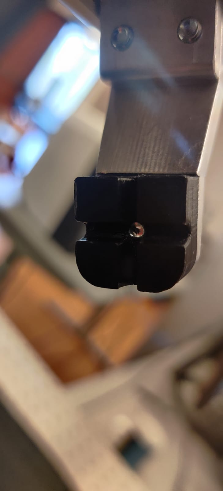
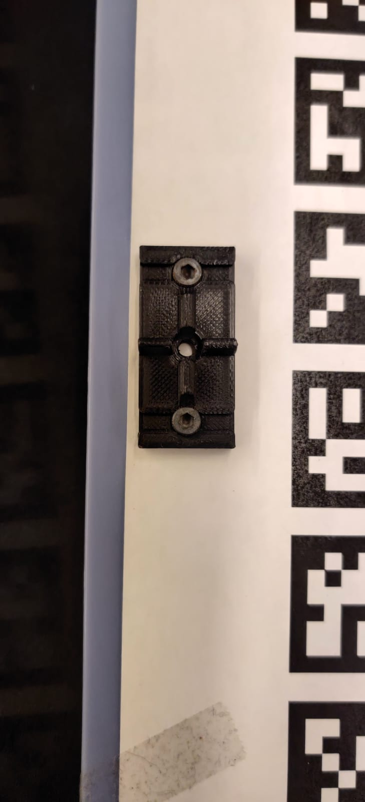
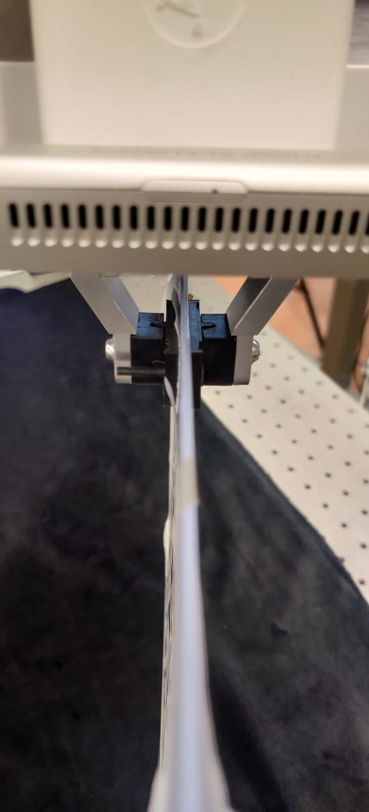

# Documentation for using the camera-robot arm extrinsic calibration tool

## Description

We provide a script for data collection and robot + single camera calibration using [algorithms available in opencv](https://docs.opencv.org/4.x/d9/d0c/group__calib3d.html#gad10a5ef12ee3499a0774c7904a801b99). There are a few available options to use the calibration tool which can be configured in a config file like the one [here](../config/robot_camera_calibration.yaml). Apart from these options, you could either move the robot manually to collect pose measurements to run the calibration routine or have the robot sample random end effector poses starting from the current end-effector pose. This highly depends on the initial end-effector pose/configuration, so make sure this is far from collisions and self-collisions and also with high manipulability. 

- Camera:
    1. use realsense sdk for intel D415, D435(i), D405 (i.e camera: realsense_camera in the config file)
    2. use any camera with a ROS node publishing images and camera_info (i.e camera: ros_camera in config file)

- Calibration target:
    1. aruco_board
    2. aruco_tag 
    3. april_board (not yet implemented)
    4. april_tag (not yet implemented)

- Robot's end effector pose measurement: 
    1. Reading from a ROS Tf tree 
    2. Reading from a zmq server running on the realtime machine

## Description of parameters in the config file
1. only_calibration
    * values = [True or False]
    * If set to true, the data last collected will be used to run the calibration algorithm. 
    * If set to False, data present in the file pointed by the string of the path specified in **calib_data_file_name** will be used to run the calibration algorithm. 
    * This option exists such that you can the run the calibration algorithm without having to rerun the time consuming data collection process. 
2. n_data
    * values = Integers
    * Specifies the no. of robot configurations to record the calibration target's pose. 
3. move_robot_automatically
    * values = [True or False]
    * If set to True, the robot moves its end-effector to randomly sampled configurations around the initial end-effector pose. "robot_pose_collector" has to be "ros_tf"
    * If set to false, the user is expected to move the end-effector manually and press "Enter" to collect each pose measurement. "robot_pose_colector" has to be "zmq"
4. debug_image
    * values = [True or False]
    * If this is true, for each of the pose measurments, the detected markers and the frame of the calibration tag are drawn and stored for debugging purposes. 
    * Nothing happens if set to False 
5. camera_in_hand
    * values = [True or False]
    * Set to True if the camera is affixed on the robot arm. 
    * Set to False if the camera is affixed to the environment. 
6. output_file
    * values = string data of a location of the file to store the calibration results as a YAML file.
7. calib_data_file_name
    * values = string data of a location of the text file to store the end effector robot poses and the calibration tag poses. or the file that already contains pose data which can be used to just run the calibration algorithm. 
8. fg_optim_data_file_name: 
    * values = string data of a directory to store pose data to use the calibration tool based on reprojection error minimization. 
9. tag_pose_collector: 
    * values = ["aruco_board", "aruco_tag", "april_board"(not yet implemented), "april_tag"(not yet implemented)]
    * This specifies the type of calibration tag used.
10. robot_pose_collector: 
    * values = ["ros_tf", "zmq"]
    * This specifies, wheter to read end-effector pose from a TF tree or using libfranka. 
    * "ros_tf" only works when "move_robot_automatically" is True 
    * "zmq" only works when "move_robot_automatically" is False
11. camera:
    * values = [realsense_camera, ros_camera]
    * realsense_camera directly uses pyrealsense sdk to get the RGB and Depth streams 
    * ros_camera needs a ROS node to be running that publishes the RGB image and the camera's intrinsics. 
12. ros_tf
    1. ee_frame: string of the name of the end effector's frame
    2. base_frame: string of the name of the robot arm's base frame
13. aruco_board:
    1. dictionary: string of the dictionary name
    2. marker_length: float value of the length of the markers in the board 
    3. marker_separation: float value of the separation distance between two markers on the board 
    4. n_rows: int value of the no.of rows of markers on the board. 
    5. n_cols: int value of the no.of columns of markers on the board. 
14. zmq: 
    1. zmq_server_ip: this has to be the realtime computer's IP
    2. zmq_server_port: this is the port used for zmq communication. This has to be same as the port passed to the C++ executable that runs on the realtime machine (i.e ./read_states)
15. ros_camera: 
    1. image_topic_name: name of the topic from which we can subscribe rgb images 
    2. camera_info_topic: name of the topic from which we can subcribe camera intrinsics. 


## Dependancies

All Dependancies are automatically installed when building the workstation docker environment.

## Calibration Process and Usage Instructions

### a. <u>Calibration Tag preparation</u> 

To perform the robot-camera calibration, we would have to first collect the calibration tag + End effector pose data for a number of configurations(15-30). To this end, to first create the calibration tag, print the PDF provided in  [calibration/calibration_board](../calibration_board)  directory. Affix this tag to a **completely** flat surface (eg. wooden board, exam pad, dibond aluminum etc), while ensuring there are no bumps when you stick the calibration tag on its surface using glue.

For the camera-in-hand case, the calibration tag is fixed to the environment rigidly. Ensure the tag doesn't move or vibrate too much throughout the calibration process.

For the camera-in-environment case, the calibration tag needs to be **rigidly** attached to the robot's End-Effector. You could use the provided CAD files for the finger tips and gripping points in [models_4_3d_printing](../models_4_3d_printing). The [finger tips](../models_4_3d_printing/franka_custom_finger_tips.stl) are to be attached to Franka End-effector and the [gripping points](../models_4_3d_printing/finger_grasp_points.stl) or [handle plate](../models_4_3d_printing/finger_handle_plate.stl) are drilled/screwed onto the calibration tag. Now make the Franka End-effector with custom finger tips(figure 1) grasp the calibration tag(as show in figure 3) with the attached custom gripping points(figure 2), this ensures that the tag remains rigid with respect to the End-effector.



figure 1: custom finger tip


 
figure 2: grasping point



figure 3: grasping calibration tag 

### b.<u> Preparation to run End-Effector Pose Collector. </u>

#### If you are using "ros_tf" as the "robot_pose_collector":

Firstly, this mode only works with automatic robot pose collection. There should already be a node running that populates the TF tree with the robot base and end-effector frames. For Franka Arm, we can get this by running a script from the workstation/docker that startsrunning [franka-interface](https://github.com/iamlab-cmu/franka-interface) on the realtime computer/docker. Follow the commands below,
  

In Real time Computer,
Start the prebuilt container

```
sudo docker-compose -f docker/realtime_computer/docker-compose-gui.yml start
```
In workstation computer,

Start the prebuilt workstation docker container

```
xhost +local:docker
sudo docker-compose -f docker/workstation_computer/docker-compose-gui.yml start
```

open a bash terminal inside the workstation docker container

```
(sudo) docker exec -it workstation_computer_docker bash
```

In the worstation computer docker terminal, launch the nodes for publishing the robot's tf tree containing robot base and end effector frames, for example: bringing up frankapy


```
cd /root/git/frankapy/
bash ./bash_scripts/start_control_pc.sh -i (realtime computer ip) -u (realtimecomputer username) -d /root/git/franka-interface -a (robot_ip) -w (workstation IP)
```

---


#### If you are using "zmq" as the "robot_pose_collector":

Firstly, this mode only works for data collection. For this, press the enable switch such that the status LEDs of the Franka arm are white now, you could now move the robot by hand by pressing the two parrallel switches on the robot's wrist, when the two switches are pressed, the robot gets in to gravity compensation mode (i.e it acts weightless). You need to now run the read states server in the realtime docker. Follow the instructions below. 

In Real time Computer,

Start the built docker container

```
sudo docker-compose -f docker/realtime_computer/docker-compose-gui.yml start
```

open a bash terminal inside the realtime docker container

```
(sudo) docker exec -it realtime_docker bash

cd /root/git/franka_control_suite/build
```

run the readstates server that sends end effector poses when requested,

```
./read_states <robot_ip> <realtime_pc_ip> <zmq_port_number>
```

  
### c.<u> Run Pose Data Collection + Calibration Script </u>
After performing previous step of setting up the "robot_pose_collector"
### In workstation computer,

Start the prebuilt workstation docker, **in case you haven't already**
```
xhost +local:docker
sudo docker-compose -f docker/workstation_computer/*docker-compose-gui.yml start
```
open a bash terminal inside the workstation docker container and go to appropriate directory
```
(sudo) docker exec -it workstation_computer_docker bash
cd /root/git/robot_toolkit
```

Now make sure to setup your config file like the one show [here](../config/robot_camera_calibration.yaml) and the run, 

```
python3 robot_camera_calibration.py --config_file <path to your config file eg: config/robot_camera_calibration.yaml>
```

The output hand eye calibration result for all available [methods](https://docs.opencv.org/4.5.4/d9/d0c/group__calib3d.html#gad10a5ef12ee3499a0774c7904a801b99) in opencv will be stored in the file mentioned in the field of "output_file" in the config YAML file. 

For the camera in hand case the output is the Transformation of the camera frame in the EndEffector's frame. For the camera in the environment case. the output is the transformation of the camera frame in the robot's base frame. 

To see how to use the calibration result file, checkout [test_pick_n_place_object.py](../test_pick_n_place_object.py)

### c.<u> Instructions for Testing </u>
For testing camera in hand configuration, run [test_pick_n_place_object.py](../test_pick_n_place_object.py) script. You can read more about it [here](../README.md).

